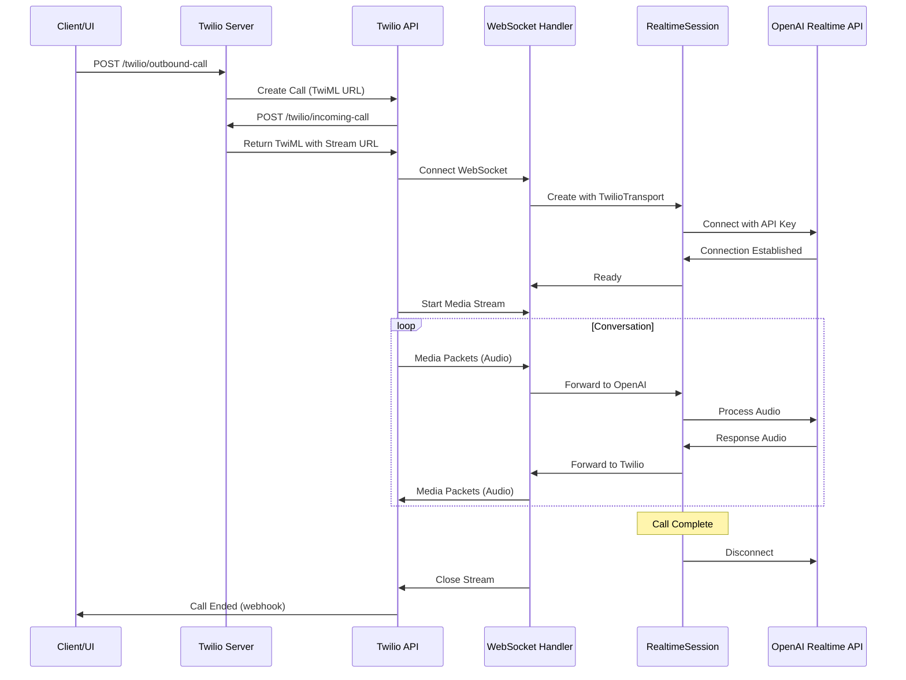

# Twilio Integration Specification

## Overview

This document specifies the implementation of Twilio voice integration for OpenAI Realtime Agents, enabling outbound phone calls with configurable prompts and tasks.

## Architecture

### Services

```
┌─────────────────────────────────────────────────────────┐
│                    Cloudflare Tunnel                     │
│         https://your-domain.com                          │
└─────────────────────────────────────────────────────────┘
                          │
                ┌─────────┴─────────┐
                │                   │
        ┌───────▼──────┐    ┌──────▼────────┐
        │   Next.js    │    │ Twilio Server │
        │   (port 3000)│    │  (port 5050)  │
        └──────────────┘    └───────────────┘
             │                      │
             │                      │
        Web UI for              Fastify with
        managing calls          WebSocket support
                                     │
                              ┌──────▼───────┐
                              │ Twilio API   │
                              │ Phone Calls  │
                              └──────────────┘
```

### Routing

- `https://your-domain.com/` → Next.js (port 3000)
- `https://your-domain.com/twilio/*` → Twilio Server (port 5050)

Cloudflared will be configured to route requests based on path prefix.

## Project Structure

```
/src/twilio/
  ├── server.ts                    # Main Fastify server entry point
  ├── routes/
  │   ├── health.ts                # Health check endpoint
  │   ├── incoming-call.ts         # TwiML response for incoming calls
  │   ├── media-stream.ts          # WebSocket handler for media streams
  │   └── outbound-call.ts         # API endpoint to initiate outbound calls
  ├── agents/
  │   ├── index.ts                 # Agent registry/factory
  │   └── outbound-task-agent.ts   # Agent for outbound call tasks
  ├── services/
  │   ├── twilio-client.ts         # Twilio SDK client wrapper
  │   └── call-manager.ts          # Call state management
  ├── types/
  │   └── index.ts                 # TypeScript interfaces
  └── utils/
      ├── logger.ts                # Logging utilities
      └── env.ts                   # Environment variable validation

/docs/features/
  ├── twilio-integration.md        # This specification
  └── twilio-testing-guide.md      # Testing procedures
```

## Dependencies

Add to `package.json`:

```json
{
  "dependencies": {
    "@openai/agents-extensions": "latest",
    "fastify": "^5.2.0",
    "@fastify/websocket": "^11.0.1",
    "@fastify/formbody": "^8.0.1",
    "@fastify/cors": "^10.0.1",
    "twilio": "^5.3.5",
    "tsx": "^4.19.2"
  },
  "devDependencies": {
    "@types/node": "^20"
  }
}
```

## Environment Variables

Update `.env.sample`:

```bash
# OpenAI Configuration
OPENAI_API_KEY=your_api_key

# Twilio Configuration
TWILIO_ACCOUNT_SID=your_account_sid
TWILIO_AUTH_TOKEN=your_auth_token
TWILIO_PHONE_NUMBER=+1234567890

# Server Configuration
TWILIO_SERVER_PORT=5050
PUBLIC_DOMAIN=your-domain.com
```

## API Endpoints

### 1. Health Check
- **Path**: `GET /twilio/health`
- **Response**: `{ "status": "ok", "timestamp": "ISO-8601" }`
- **Purpose**: Verify server is running

### 2. Incoming Call Handler
- **Path**: `POST /twilio/incoming-call`
- **Content-Type**: `application/x-www-form-urlencoded`
- **Request Body**: Twilio webhook parameters
- **Response**: TwiML XML
- **Purpose**: Handle incoming calls and return TwiML to connect media stream

**Response Example**:
```xml
<?xml version="1.0" encoding="UTF-8"?>
<Response>
    <Say>Please wait while we connect you.</Say>
    <Connect>
        <Stream url="wss://your-domain.com/twilio/media-stream" />
    </Connect>
</Response>
```

### 3. Media Stream WebSocket
- **Path**: `WS /twilio/media-stream`
- **Protocol**: WebSocket
- **Purpose**: Receive/send real-time audio from Twilio

**Connection Flow**:
1. Twilio establishes WebSocket connection
2. Server creates `TwilioRealtimeTransportLayer`
3. Server creates `RealtimeSession` with selected agent
4. Session connects to OpenAI Realtime API
5. Bidirectional audio streaming begins

**Events Received from Twilio**:
- `connected`: Stream connection established
- `start`: Media stream started
- `media`: Audio payload (base64 encoded μ-law)
- `stop`: Media stream stopped

### 4. Outbound Call API
- **Path**: `POST /twilio/outbound-call`
- **Content-Type**: `application/json`
- **Authentication**: Bearer token (optional for MVP)

**Request Body**:
```json
{
  "to": "+1234567890",
  "task": {
    "type": "appointment_reminder" | "survey" | "notification" | "custom",
    "prompt": "You are calling to remind the user about their appointment tomorrow at 2 PM.",
    "context": {
      "appointmentDate": "2025-10-02T14:00:00Z",
      "customerName": "John Doe"
    }
  },
  "agentConfig": {
    "voice": "verse",
    "model": "gpt-4o-realtime-preview"
  }
}
```

**Response**:
```json
{
  "success": true,
  "callSid": "CAxxxx",
  "status": "initiated",
  "estimatedDuration": "60-120 seconds"
}
```

**Error Response**:
```json
{
  "success": false,
  "error": "Invalid phone number format",
  "code": "INVALID_PHONE"
}
```

## Agent Configuration

### Outbound Task Agent

File: `src/twilio/agents/outbound-task-agent.ts`

**Purpose**: Execute a specific task via outbound call with dynamic prompt injection.

**Features**:
- Dynamic instruction templating based on task type
- Call completion detection
- Task result reporting
- Graceful call termination

**Agent Factory**:
```typescript
export function createOutboundTaskAgent(task: OutboundTask): RealtimeAgent {
  const instructions = generateInstructions(task);

  return new RealtimeAgent({
    name: 'outbound-task-agent',
    voice: task.agentConfig?.voice || 'verse',
    instructions,
    tools: getToolsForTaskType(task.type),
    handoffs: [],
  });
}
```

**Instruction Template**:
```
You are an AI assistant making an outbound phone call.

# Your Task
{task.prompt}

# Context
{JSON.stringify(task.context)}

# Guidelines
- Be polite and professional
- Identify yourself as an AI assistant at the start
- Complete the task efficiently
- Confirm understanding before ending the call
- If the person wants to speak to a human, apologize and say you'll have someone call back
- Keep the call under 2 minutes unless the conversation naturally extends

# Call Structure
1. Greeting: "Hello, this is an AI assistant calling on behalf of [company]."
2. Purpose: Clearly state why you're calling
3. Execute: Complete the task
4. Confirmation: Confirm the person understood
5. Closing: Thank them and end the call

# Example Opening
"Hello! This is an AI assistant. {task.prompt}"
```

**Task Types**:

1. **appointment_reminder**
   - Tools: None
   - Focus: Deliver reminder, confirm attendance

2. **survey**
   - Tools: `recordSurveyResponse`
   - Focus: Ask questions, collect responses

3. **notification**
   - Tools: None
   - Focus: Deliver message, confirm receipt

4. **custom**
   - Tools: Configurable
   - Focus: Execute custom prompt

## Call Flow

### Outbound Call Sequence



## Docker Configuration

Update `.devcontainer/docker-compose.yml`:

```yaml
services:
  app:
    image: mcr.microsoft.com/devcontainers/typescript-node:1-20-bookworm
    volumes:
      - ..:/workspaces/openai-realtime-agents:cached
      - ~/.gitconfig:/home/node/.gitconfig:cached
    command: sleep infinity
    network_mode: service:cloudflared
    env_file:
      - ../.env

  twilio-server:
    image: mcr.microsoft.com/devcontainers/typescript-node:1-20-bookworm
    volumes:
      - ..:/workspaces/openai-realtime-agents:cached
    working_dir: /workspaces/openai-realtime-agents
    command: npm run twilio:dev
    network_mode: service:cloudflared
    env_file:
      - ../.env
    depends_on:
      - app

  cloudflared:
    image: cloudflare/cloudflared:latest
    restart: unless-stopped
    env_file:
      - cloudflared.env
    command: ["tunnel", "--no-autoupdate", "run"]
```

## Cloudflare Tunnel Configuration

Update tunnel ingress rules via Cloudflare dashboard:

```yaml
ingress:
  - hostname: your-domain.com
    path: /twilio/*
    service: http://localhost:5050
  - hostname: your-domain.com
    service: http://localhost:3000
  - service: http_status:404
```

## NPM Scripts

Add to `package.json`:

```json
{
  "scripts": {
    "dev": "next dev",
    "build": "next build",
    "start": "next start",
    "lint": "next lint",
    "twilio:dev": "tsx watch src/twilio/server.ts",
    "twilio:start": "tsx src/twilio/server.ts",
    "dev:all": "concurrently \"npm run dev\" \"npm run twilio:dev\""
  }
}
```

## Implementation Steps

### Phase 1: Server Setup

1. ✅ Install dependencies
   ```bash
   npm install @openai/agents-extensions fastify @fastify/websocket @fastify/formbody @fastify/cors twilio tsx concurrently
   ```

2. ✅ Create directory structure
   ```bash
   mkdir -p src/twilio/{routes,agents,services,types,utils}
   ```

3. ✅ Set up environment variables
   - Update `.env.sample`
   - Add Twilio credentials to `.env`

4. ✅ Create base Fastify server (`src/twilio/server.ts`)
   - Initialize Fastify
   - Register plugins (websocket, formbody, cors)
   - Set up error handling
   - Listen on port 5050

### Phase 2: Core Routes

5. ✅ Implement health check endpoint
   - `src/twilio/routes/health.ts`

6. ✅ Implement incoming call handler
   - `src/twilio/routes/incoming-call.ts`
   - Return TwiML with Stream URL

7. ✅ Implement WebSocket media stream handler
   - `src/twilio/routes/media-stream.ts`
   - Create `TwilioRealtimeTransportLayer`
   - Create `RealtimeSession`
   - Connect to OpenAI

### Phase 3: Agent Configuration

8. ✅ Create outbound task agent factory
   - `src/twilio/agents/outbound-task-agent.ts`
   - Dynamic instruction generation
   - Task type handling

9. ✅ Create agent registry
   - `src/twilio/agents/index.ts`
   - Map task types to agent configurations

### Phase 4: Outbound Calls

10. ✅ Create Twilio client service
    - `src/twilio/services/twilio-client.ts`
    - Initialize Twilio SDK
    - Create call method

11. ✅ Implement outbound call endpoint
    - `src/twilio/routes/outbound-call.ts`
    - Validate request
    - Create agent
    - Initiate Twilio call

12. ✅ Add call state management
    - `src/twilio/services/call-manager.ts`
    - Track active calls
    - Store call metadata

### Phase 5: Integration

13. ✅ Update docker-compose
    - Add twilio-server service
    - Configure networking

14. ✅ Configure Cloudflare Tunnel
    - Update ingress rules
    - Test routing

15. ✅ Add NPM scripts
    - `twilio:dev` for development
    - `dev:all` to run both servers

### Phase 6: Testing

16. ✅ Test health endpoint
17. ✅ Test incoming call flow
18. ✅ Test WebSocket connection
19. ✅ Test outbound call initiation
20. ✅ End-to-end test with real phone number

## Testing Checklist

- [ ] Health endpoint returns 200
- [ ] Incoming call returns valid TwiML
- [ ] WebSocket accepts connections from Twilio
- [ ] RealtimeSession connects to OpenAI
- [ ] Audio flows bidirectionally
- [ ] Agent responds appropriately
- [ ] Call terminates gracefully
- [ ] Outbound call API validates input
- [ ] Outbound call creates Twilio call
- [ ] Error handling works for invalid requests
- [ ] Environment variables are validated
- [ ] Logs provide useful debugging info

## Security Considerations

1. **Webhook Validation**
   - Verify Twilio request signatures
   - Implement in middleware

2. **API Authentication**
   - Add bearer token for outbound call API
   - Rate limiting

3. **Environment Variables**
   - Never commit `.env`
   - Validate on startup

4. **Error Handling**
   - Don't leak sensitive info in errors
   - Log errors securely

## Monitoring & Logging

### Key Metrics
- Calls per minute
- Average call duration
- Success/failure rate
- OpenAI API latency
- WebSocket connection stability

### Log Levels
- **DEBUG**: Twilio events, audio packets
- **INFO**: Call started/ended, agent selection
- **WARN**: Reconnection attempts, degraded performance
- **ERROR**: Failed calls, API errors

### Debug Mode
Enable verbose logging:
```bash
DEBUG=openai-agents:extensions:twilio* npm run twilio:dev
```

## Future Enhancements

1. **Call Recording**
   - Store audio for quality assurance
   - Transcription storage

2. **Analytics Dashboard**
   - Real-time call monitoring
   - Success rate metrics
   - Cost tracking

3. **Advanced Routing**
   - Agent selection based on caller
   - Business hours handling
   - Call queuing

4. **Multi-language Support**
   - Language detection
   - Dynamic voice selection

5. **Integration with CRM**
   - Automatic call logging
   - Contact lookup
   - Follow-up scheduling

## References

- [Twilio Media Streams API](https://www.twilio.com/docs/voice/media-streams)
- [OpenAI Agents SDK - Twilio Adapter](https://github.com/openai/openai-agents-js)
- [Fastify WebSocket Plugin](https://github.com/fastify/fastify-websocket)
- [Cloudflare Tunnel Ingress](https://developers.cloudflare.com/cloudflare-one/connections/connect-networks/routing-to-tunnel/)

## Success Criteria

The implementation is complete when:

1. ✅ Server runs on port 5050
2. ✅ All endpoints respond correctly
3. ✅ WebSocket handles Twilio media streams
4. ✅ Agent can conduct outbound calls
5. ✅ Cloudflared routes traffic properly
6. ✅ Environment variables are documented
7. ✅ Error handling is comprehensive
8. ✅ Logging provides visibility
9. ✅ Tests pass (manual verification)
10. ✅ Documentation is complete
